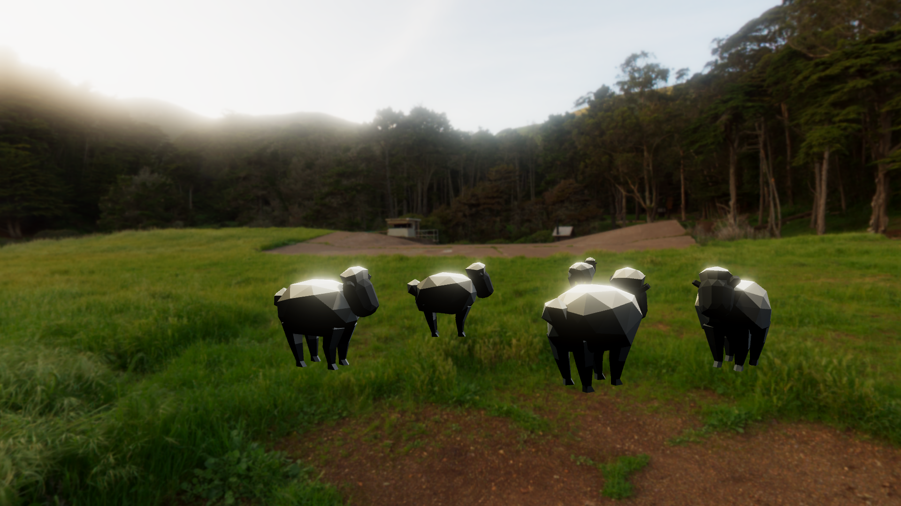
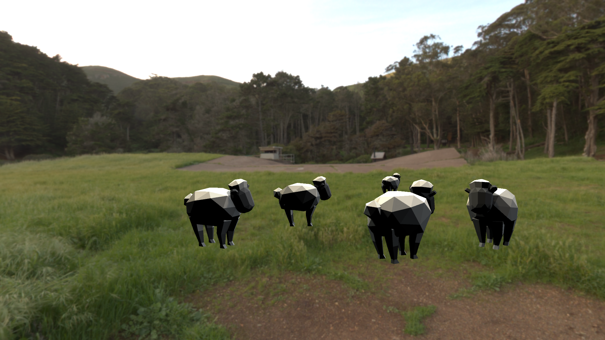

# Unity-Color-Grading
I wanted to explore how the postprocessing stack could change the renderd image in Unity. Several screenshots are shown below, which might help you understand each diffrence. Hope that would help you develop cool stuff ;)

Video on [YouTube](https://youtu.be/eSRw67ZwLzI)

## Creative Commons [CC-BY](https://creativecommons.org/licenses/by/3.0/legalcode)
- [Abstract Art](https://poly.google.com/view/d3uGg-s0ZcF) is created by [Jarlan Perez](https://poly.google.com/user/4lZfAdz3x3X) Google under a CC-BY license
- [Sheep](https://poly.google.com/view/aWFQcDSaDyo) is created by [Poly by Google](https://poly.google.com/user/4aEd8rQgKu2) under a CC-BY license
